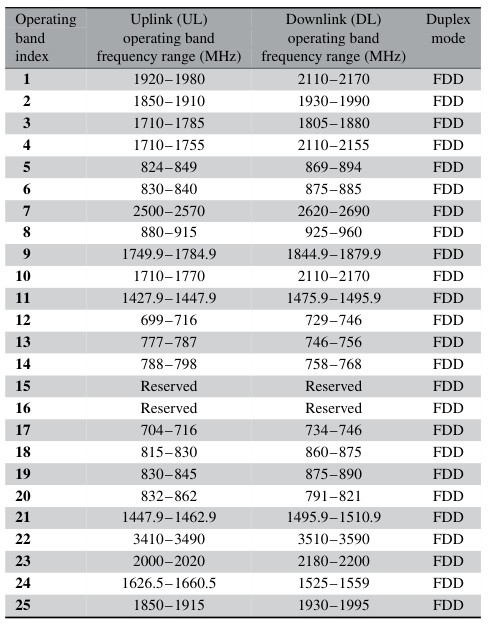
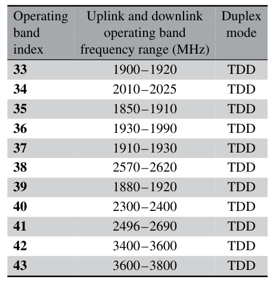
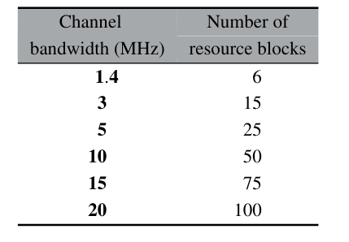
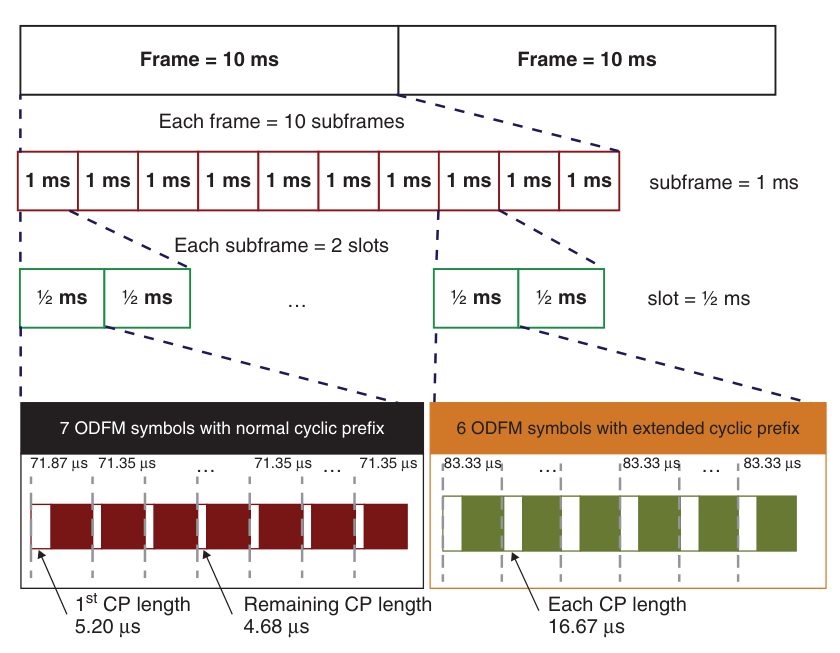
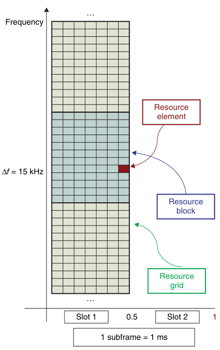
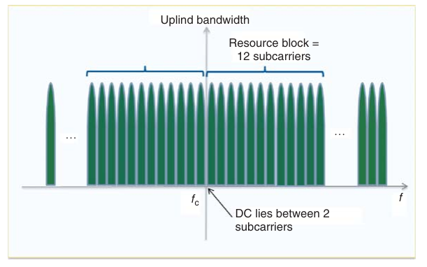
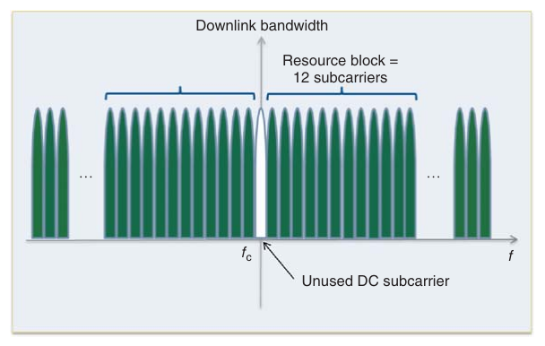
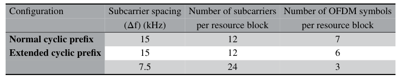
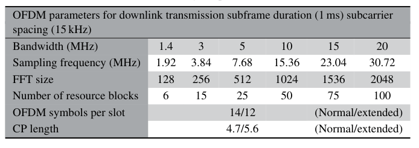

.. _lte:

================
LTE 物理层
================

.. contents:: :local:

.. _introduction:

简介
------------

本文介绍 **Long Term Evolution（LTE）** 的 **Physical Layer（PHY）**，简单了解一下其底层设计的基本结构。

.. _related:

相关知识
----------

- **空中接口（Air Interface）：
^^^^^^^^^^^^^^^^^^^^^^^^^^^^^^^^
** LTE 采用的是基于 **Orthogonal Frequency Division Multiplexing Access（OFDMA）** 技术的无线多址接入。其下行采用 OFDM，上行采用与之相类似的 **Single-Carrier Frequency Division Multiplexing（SC-FDM）**。相比之前的多址接入技术，OFDMA 具有抗多径衰落、支持 MIMO、频率选择等诸多优势。

- **频谱带宽（Frequency Bands）：** 3GPP规定 **Frequency-division Duplex（FDD）** 与 **Time-division Duplex（TDD）**，频分双工与时分双工的频带资源如下：
**FDD** for Evolved Universal Terrestrial Radio Access Network（E-UTRAN）:

**TDD** for Evolved Universal Terrestrial Radio Access Network（E-UTRAN）:

- **单播与多播（Unicast and Multicast Services）：** 在 LTE 中单播是指数据只传输给一个用户，与之相对应的多播 **Multimedia Broadcast/Multicast Services（MBMS）** 一般是指电视、广播以及视频流等数据的传输，其传播都有自己专用的信道与系统。

- **带宽分配（Allocation of Bandwidth）：** LTE 物理层中，一个资源块 **Physical Resource Block（PRB）** 带宽为180KHz，其中包含了12个宽带为15KHz的子载波。由 IMT-advanced 规定了比较灵活的带宽分配，范围为1.4MHz-20MHz，其包含的资源块如下：除了1.4MHz的占用率为77%外，其它频谱占用率达到了90%，之所以不占满是因为有保护频段，防止频谱泄漏。

- **时域分帧（Time Framing）：** 在LTE中时间轴上被进行分帧处理，这样有利于信道的估计以应对时变的信道。一帧（frame）时长为10ms被分成了10个1ms的子帧 （subframe），每一个子帧又被分为0.5ms的两个时隙（time slots），每一个时隙包含了6或者7个 **OFDM符号**。具体如下图所示：

- **时频域的映射（Time–Frequency Representation）：** 理解 OFDM 符号是如何被传输的，其理解该符号是如何被映射到时频域资源的，这一点是非常重要的。信号在经过编码，星座图映射以后变成一个复值信号，此时将会映射到所谓的时频坐标系，该坐标系横坐标是时间，纵坐标是频率。

上图很好地说明了信号是如何被映射到时频域的。这里一个 PRB 是指在一个时隙内的180KHz频谱资源，也就是12个子载波持续0.5ms。这里的 Resource Element 指的是复值的调制信号。上图每个时隙包含了7个 OFDM 符号，因此一个资源块将有12*7，84个 Resource Element，资源块是 LTE 中传输的最小单位。值得说明的是为什么选择15KHz为子载波的间隙（Subcarrier Spacing），这是因为15KHz很好的符合了 OFDM 的指令，将衰落信道转化为一系列可分辨的平坦信道，大大提高了系统的抗衰落能力。此外，在上行链路中，子载波在载波中心频率两边，相反在下行中与载波中心频率一致的子载波不会被使用 (涉及到过高的干扰问题)，具体如下图：

上行：

下行：

- **OFDM 的多子载波传输（OFDM Multicarrier Transmission）：** 我们知道 LTE 的上下行是基于 OFDM 多址技术的，这是一种多子载波传输的方法，这里理解它是如何传输的，有助于我们理解一个 OFDM 符号到底是什么。我将介绍一个 OFDM 符号是如何产生的：

  - **step 1**. 首先将星座图映射后 (比如QAM) 的复值信号，即 Resource Element 映射到我们的时频资源栅格上，将这些符号分配好时频资源。如果有 :math:`N` 个间隔为 :math:`\Delta f` 的子载波，则有：

   .. math::

        \begin{equation}
        B W=N_{r b} \Delta f
        \end{equation}

   每个子载波的频率 :math:`f_k` 可以被看做是频率间隔 :math:`\Delta f` 的整数倍，即：

   .. meta::

        \begin{equation}
        f_k=k \Delta f
        \end{equation}

  - **step 2**. 每一个经过星座图映射之后符号 :math:`a_k` 都是一个复数 :math:`a_k=a+jb` 信号（QAM），接下过经过 OFDM 调制器分别对这些信号进行调制，即是将这些复数信号分别乘以复数子载波，每一个符号被分配一个单独的子载波，即：

     .. math::

         \begin{equation}
        x(t)=\sum_{k=1}^N a_k e^{j 2 \pi f_k t}=\sum_{k=1}^N a_k e^{j 2 \pi k \Delta f t}
        \end{equation}

    实际操作是离散的OFDM表示，这里需要假设信道的采样率为 :math:`F`，则采时间为 :math:`T=1/F`，采样点数为 :math:`N` ，假设符号周期为 :math:`T_s=NT` 则有：

       .. math::

            \begin{equation}
            x(n)=\sum_{k=1}^N a_k e^{j 2 \pi k \Delta f n / N}
            \end{equation}

    可以看到上述表示可以很自然使用 IFFT 变换实现，这也是使用 OFDM 如此广泛的原因。我们也可以从表示看出一个 OFDM 符号是包含目前所有已经映射好的符号 :math:`a_k` 的调制求和。

  - **step 3**. 在经过 OFDM 调制后，一个 OFDM 符号就已经生成了，最后还需要给每一个符号加上一个循环前缀，其实就是将该符号的后面一部分复制到前面以消除符号间干扰（ISI）和子载波间干扰（ICI）。每一个 OFDM 符号的时域持续时间，它是由两部分构成的循环前缀加上信号周期，信号周期 1/15000 s，即是，大约66.7 :math:`\mu` s。

 - **循环前缀（Cyclic Prefix）：** 循环前缀有不同的大小，由于存在多径效应而导致的符号间干扰，同时为保证子载波之间的正交性，前缀是符号尾部的一段复制。LTE协议中按照下图规定了循环前缀的长度：

 - **频域调度（Frequency-Domain Scheduling）：** 频域的调度是 LTE 中很重要的一点，由于 LTE 本身支持不同的频率带宽，OFDM 可以根据 IFFT 和 FFT 选择不同的符号长度，变化的点数。尽管 LTE 并没有规定带宽与 FFT 长度之间的关系，但一般2048与20MHz相关联，其他分配如下图：

.. _reference:

参考
------------

- Zarrinkoub, Houman. Understanding LTE with MATLAB: from mathematical modeling to simulation and prototyping. John Wiley & Sons, 2014.
