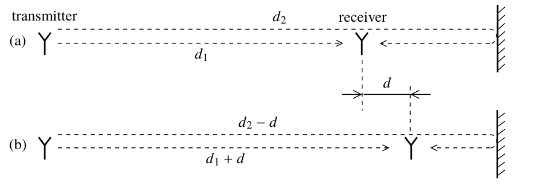
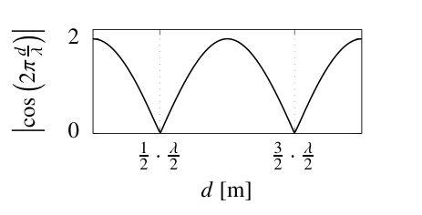

.. _wireless_channel:

================
无线信道
================

.. contents:: :local:

.. _introduction:

简介
------------

无线通信中的信道是复杂的，大多数研究资料都将其大致分为大尺度衰落和小尺度衰落，针对此也有层出不穷的信道模型，但无论是基于经验的抑或是基于统计的信道建模，关于无线信道的研究总是避免不了两个基本概念。

本文主要介绍无线通信系统中有关信道的两个非常重要的概念：**相干时间（Coherence Time）** 与 **相干带宽（Coherence Bandwidth）**。

相干时间（Coherence Time）
___________________________

无线通信系统的信道非常复杂，信号从发射端到接收端所面临的环境包含了反射，绕射，衍射，散射，相干，阴影等由障碍物所引起的效应，这对信号的在空间中的传输造成了很大的影响，这也无线通信的难点之一。

在介绍相干时间之前，我们先来回顾一下什么叫做线性时不变系统（LTI）：
假设输入信号为 :math:`x_1(t),\,x_2(t)` ，对应的输出信号为 :math:`y_1(t),\,y_2(t)` ，即如果有：

.. math::

   x_1(t) \rightarrow  y_1(t),\quad x_2(t) \rightarrow y_2(t)

则有：

.. math::

   ax_1(t-t_0)  + bx_2(t-t_0) \rightarrow ay_1(t-t_0)+by_2(t-t_0)

那么我们说这个系统是线性时不变系统。LTI 系统是信号与系统处理中的最常见模型，也是最简单的模型，只有在该模型下，我们才会考 DTFT，CTFT，DFT，FFT 等以及它们相关的性质才会成立。由于麦克斯韦方程的线性，系统往往是线性可加的（需要注意的是在某些非线性介质或非线性效应的情况下，电磁波的行为可能会变得更加复杂），但同时由于发送端与接收端的移动性，时不变往往是很难做到的。

-  **Definition 1.** *The time during which the channel can be reasonably well viewed as time-invariant is called the coherence time and denoted by* :math:`T_c` *(measured in seconds).*

从定义可以看到，在 :math:`T_c` 这段时间内，系统可以视为具有时不变的性质，那么这段时间的长度是由什么决定的或者它的值与什么有关呢？让我们考虑一个简单的两径传播模型：

一条LoS直射路径和一条反射路径，信号带宽足够小，延时考虑为相移的情况下，有：

.. math::

    \begin{aligned}
    y(t) & =\left(e^{-i 2 \pi f_{\mathrm{c}} \frac{d_1}{c}}+e^{-i 2 \pi f_{\mathrm{c}} \frac{d_2}{c}}\right) x(t) \\
    & =\left(e^{-i 2 \pi \frac{d_1}{\lambda}}+e^{-i 2 \pi \frac{d_2}{\lambda}}\right) x(t),
    \end{aligned}

假设在 (a) 位置时，信号刚好能够叠加达到最大，即是， :math:`y(t)=2x(t)`。假设接下来接收端向右移动 :math:`d`，则在 (b) 时有：

.. math::

    \begin{aligned}
    y(t) & =\left(e^{-i 2 \pi \frac{d}{\lambda}}+e^{-i 2 \pi \frac{-d}{\lambda}}\right) x(t) \\
    & =2 \cos \left(2 \pi \frac{d}{\lambda}\right) x(t) .
    \end{aligned}

由表达式可以看出，信号在 :math:`\lambda/2` 之内会呈现周期性变化，也就是说只要移动的距离不超过 :math:`\lambda/2` ，那么我们可以认为信道是时不变的，如果此时接收端的移动速度为 :math:`v`，那么：

.. math::

   T_{\mathrm{c}}=\frac{\lambda}{2 v} \quad \text { seconds. }

这里可以看出相干时间是因为发射端和接收端相对移动所引起的，那也就意味着与多普勒效应有关，因此相干时间的倒数我们常常称之为多普勒扩展
(Doppler spread)，它往往是定义为多普勒效应所造成的最大频偏。当然，实际信道由直射路径和多个散射路径组成，但不管怎么样，上述的定义往往是可以接受的。

.. note::

    相干时间实际上是通道脉冲响应本质上不变的持续时间的统计测量，并量化了通道的相似性不同时间的通道响应。换句话说，相干时间是两个接收信号具有很强的幅度相关潜力的持续时间。如果基带信号的带宽倒数大于信道的相干时间，则在基带消息传输过程中信道将发生变化，从而在接收器处造成失真，即当信号的传输时间小于相干时间的时候，我们认为信号是不会失真的。

相干带宽（Coherence Bandwidth）
_________________________________
我们考虑信号的持续时间小于相干时间（:math:`T_c`），此时的系统为 LTI 系统，根据卷积与频域的关系，我们可以得到：

.. math::

   y(t)=\int_{-\infty}^{\infty} d \tau g(\tau) x(t-\tau)

.. math::

   G(f)=\int_{-\infty}^{\infty} d t g(t) e^{-i 2 \pi f t}

其中 :math:`g(t)` 是信道脉冲相应。

- **Definition 2.** *The length of a frequency interval over which :math:`|G( f )|` is approximately constant is called the coherence bandwidth and denoted by :math:`B_c` (measured in Hz).*

可以看出，在频域内信道相应的幅值大概保持不变的一段频率称为相干带宽。现假设传输的信号为正弦信号\ :math:`x(t)=sin(t)=e^{i2\pi ft}`\ ，则有：

.. math::

   y(t)=\left(e^{-i 2 \pi\left(f_{\mathrm{c}}+f\right) \frac{d_{1}}{c}}+e^{-i 2 \pi\left(f_{\mathrm{c}}+f\right) \frac{d_{2}}{c}}\right) e^{i 2 \pi f t}

信道频率响应：

.. math::

   \begin{aligned}
   G(f) &=e^{-i 2 \pi\left(f_{\mathrm{c}}+f\right) \frac{d_{1}}{c}}+e^{-i 2 \pi\left(f_{\mathrm{c}}+f\right) \frac{d_{2}}{c}} \\
   &=e^{-i 2 \pi f \frac{d_{1}}{c}}+e^{-i 2 \pi f \frac{d_{2}}{c}}
   \end{aligned}

幅值：

.. math::

   \begin{aligned}
   |G(f)| &=\left|e^{-i 2 \pi f \frac{d_{1}}{c}}+e^{-i 2 \pi f \frac{d_{2}}{c}}\right| \\
   &=2\left|\cos \left(\pi f \frac{d_{1}-d_{2}}{c}\right)\right|
   \end{aligned}

|image2|

这是跟中心频率没有关系的表达式。由上图可知，我们定义\ :math:`B_c`\ 为：

.. math::

   B_{\mathrm{c}}=\frac{c}{\left|d_{1}-d_{2}\right|} \quad \mathrm{Hz}

因此我们希望在这段长度的频率范围内，信道幅值响应是一个比较恒定的值。在实际的场景中，信道更加复杂，这里的分母被定义为在所有传播路径中差别最大的路径。当信号的带宽小于相干带宽时，我们认为信号是不会发生失真的。同样相干带宽的倒数我们定义为时延拓展
(Time
spread)，\ :math:`g(t)`\ 也被限制在时延拓展之内，相似地，当信号的带宽小于相干带宽，或者说信号的传输时间（周期）大于时延拓展（信号之间没有干扰），我们认为信号是没有失真的。

相干间隔（Coherence Interval）
_____________________________

-  **Definition 3**\ *. A time-frequency space of duration :math:`T_c`
   seconds and bandwidth :math:`B_c` Hz is called a coherence interval.*

信号在时频域同时满足相干时间与相干带宽的，称之为相干间隔。我们定义一个相干间隔的长度为：

.. math::

   \tau_{\mathrm{c}}=B_{\mathrm{c}} T_{\mathrm{c}} \quad \text { samples. }

:math:`B_{\mathrm{c}}` 表示频率，即单位时间采样了多少个点，一共采样了
:math:`T_{\mathrm{c}}`
秒，因此这里可以理解为样本的个数。下图给出了一些参考的数据： |image3|
其中子载波频率为2GHz，波长为15cm。

总结
_____________________________

以下针对相干时间与相干带宽做一下总结：

-  不管是相干时间还是相干带宽都是描述的信道参数。
-  相干时间反映的是信道的时间色散效应，其实就是指的是，信道所能保持不变的最大时间间隔，因此我们要保证信号的持续时间小于相干时间。
-  相干带宽反映的是信道的频率色散效应，其实就是指的是，信道所能保持不变的最大频率间隔，因此我们要保证信号的带宽小于相干带宽。
-  相干时间是描述多谱勒扩展的，如上述所说，相干时间其实是由多普勒频移所造成，多普勒频移又是由相对运动产生的，它与相干时间是呈倒数关系。相对运动越快，多普勒频移越大，相干时间就越小。
-  相干带宽是描述时延扩展的，如上述所说，相干带宽其实是由多径所造成，正是因为存在多条路径，才会有不同的延时，它与相干带宽是呈倒数关系。差别最大的延时相差越多，时延拓展越大，相干带宽就越小。
-  定义相干时间一般是用来划分时间非选择性衰落信道和时间选择性衰落信道，或叫慢衰落信道和快衰落信道的量化参数。如果信号的周期大于相干时间，则信号经历快衰落，表示信道在符号周期内发生了变化，此时信道的均衡与估计都很难，反之则是慢衰落。
-  定义相干带宽一般是用来划分平坦衰落信道和频率选择性衰落信道的量化参数。如上所说，如果信号的带宽大于相干带宽，则信号将会经历频率选择性衰落，反之则是平坦衰落。
-  在相干时间内，两路信号受到的传输函数也是相似的特性，通常发射的一路信号由于多径效应，有多路到达接收机，若这几路信号的时间间隔在相干时间之内，那么他们具有很强的相关性，接收机都可以认为是有用信号，若大于相干时间，则接收机无法识别，只能认为是干扰信号。
-  当两个发射信号的频率间隔小于信道的相干带宽，那么这两个经过信道后的，受到的信道传输函数是相似的，由于通常的发射信号不是单一频率的，即一路信号也是占有一定带宽的，如果，这路信号的带宽小于相干带宽，那么它整个信号受到信道的传输函数是相似的，即信道对信号而言是平坦特性的，非频率选择性衰落的。

.. |在这里插入图片描述| image:: https://img-blog.csdnimg.cn/20210112112703142.png?x-oss-process=image/watermark,type_ZmFuZ3poZW5naGVpdGk,shadow_10,text_eGlhb2JvX3NjdXQ=,size_16,color_FFFFFF,t_70#pic_center
.. |image1| image:: https://img-blog.csdnimg.cn/20210112113949683.png?x-oss-process=image/watermark,type_ZmFuZ3poZW5naGVpdGk,shadow_10,text_eGlhb2JvX3NjdXQ=,size_16,color_FFFFFF,t_70#pic_center
.. |image2| image:: https://img-blog.csdnimg.cn/20210112121812859.png?x-oss-process=image/watermark,type_ZmFuZ3poZW5naGVpdGk,shadow_10,text_eGlhb2JvX3NjdXQ=,size_16,color_FFFFFF,t_70#pic_center
.. |image3| image:: https://img-blog.csdnimg.cn/20210112182210258.png?x-oss-process=image/watermark,type_ZmFuZ3poZW5naGVpdGk,shadow_10,text_eGlhb2JvX3NjdXQ=,size_16,color_FFFFFF,t_70#pic_center
